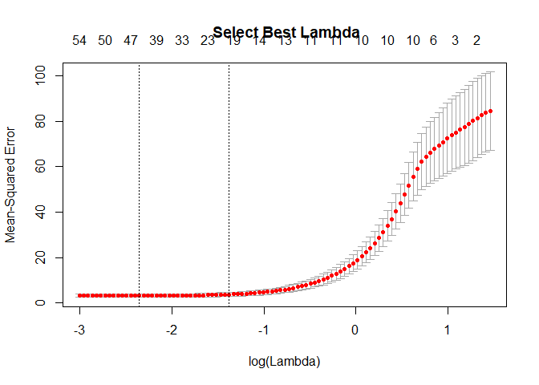
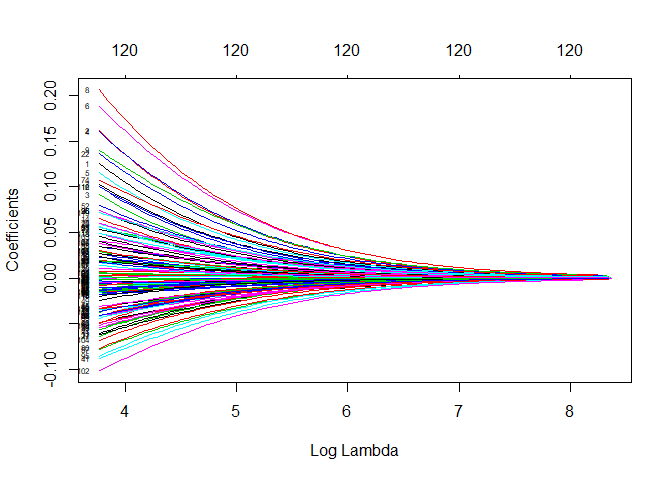
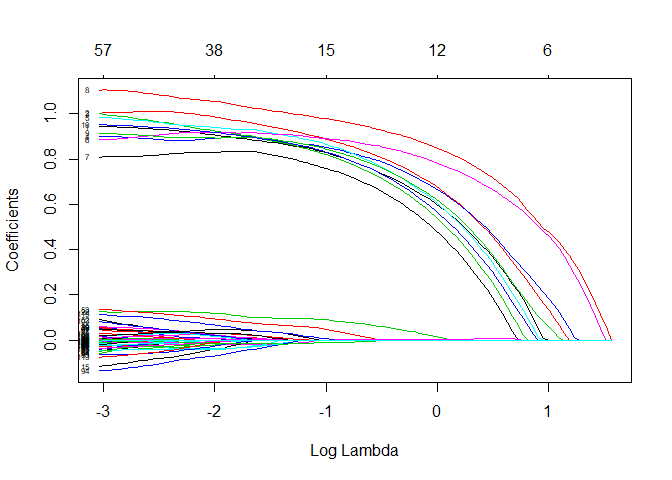
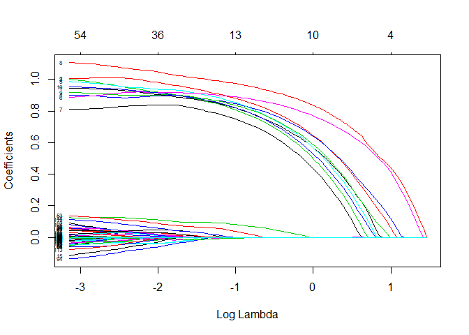
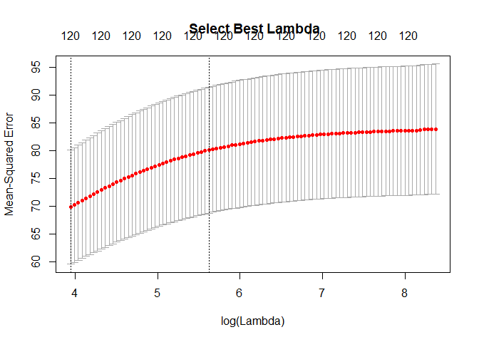
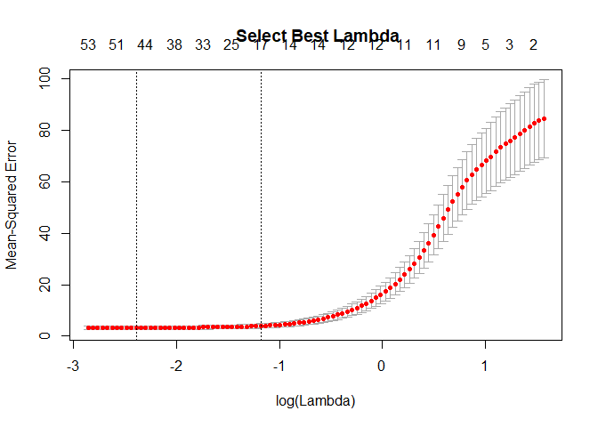
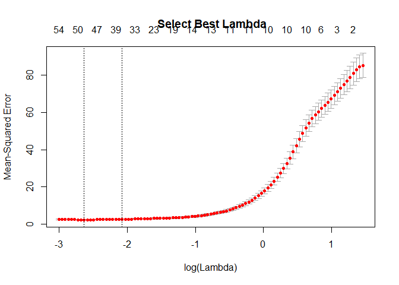
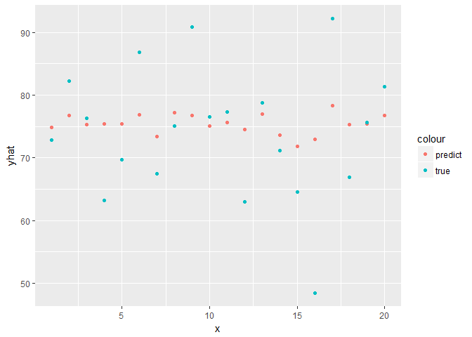
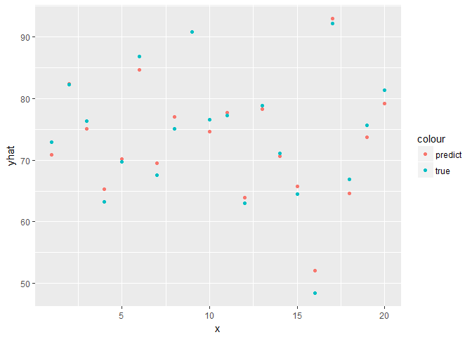
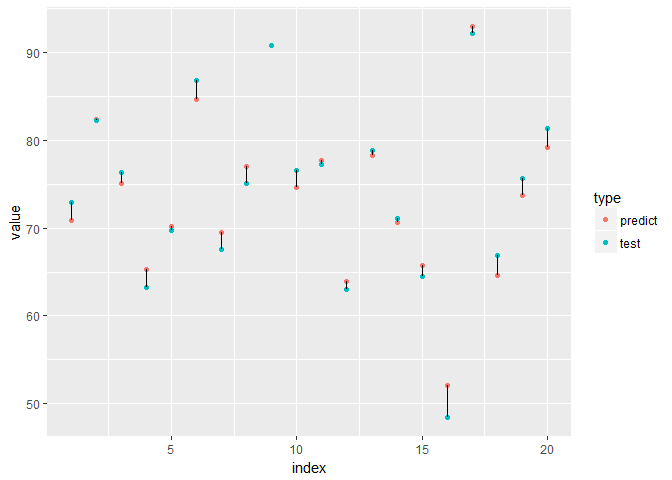

hw5 select the best alpha for elastic net regression
================
Kaki
2018/2/14&gt;

``` r
library(ggplot2)
library(dplyr)
```

    ## 
    ## Attaching package: 'dplyr'

    ## The following objects are masked from 'package:stats':
    ## 
    ##     filter, lag

    ## The following objects are masked from 'package:base':
    ## 
    ##     intersect, setdiff, setequal, union

``` r
library(glmnet)
```

    ## Loading required package: Matrix

    ## Loading required package: foreach

    ## Loaded glmnet 2.0-13

``` r
library(pls)
```

    ## 
    ## Attaching package: 'pls'

    ## The following object is masked from 'package:stats':
    ## 
    ##     loadings

``` r
library(tidyr)
```

    ## 
    ## Attaching package: 'tidyr'

    ## The following object is masked from 'package:Matrix':
    ## 
    ##     expand

Set simulated data
==================

``` r
set.seed(1234) # set seed to generate the same data every time you run the code; for different repetition, comment out this line
n = 100                                     # sample size
p = 120                                     # p > n => Big-p Data Problem
pp = 10                                     # true variables 
beta1=rbind(1,1,1,1,1)                      # 5 coefficients for first five vars as a 5 x 1 vector
beta2=rbind(1,1,1,1,1)                      # 5 coeffs for for second five vars as a 5 x 1 vector
beta0 = t(t(rep(0,1,110)))                  # 110 insignificant betas as 110 x 1 vector

x=matrix(runif(n*p, min=0, max=10), n, p)   # randon uniform variates from U(0, 10) arranged in matrix n x p
z1=x[,1:5] %*% beta1                        # first simulated factor z1 = sum of x1 through x5
z2=x[,6:10] %*% beta2                       # second factor z2
yy= z1 + 10*sqrt(z2)                        # true dependent variable
y = yy + x[,11:120] %*% beta0 + rnorm(n)    # observed dependent variable with 100 regressors insignificant vars but we don't know that ex ante
```

Partition training and test data sets
=====================================

``` r
m = 0.8*n                                   # 80% training size ==> 20% holdout sample
ts = sample(1:n,m)                          # random draw of 80 out of 100 rows
x.train = x[ts,]                            
y.train = y[ts]

x.test = x[-ts,]
y.test = y[-ts]

nrow(x.test)
```

    ## [1] 20

Set alpha = 0.1 to 0.9 and find the best Best-alpha for Elastic Net Regression
==============================================================================

``` r
max_r2 = -Inf
best_alpha = NULL

cv=cv.glmnet(x.train, y.train, type.measure="mse", nfolds = 10)    # 10-fold cross-validation
plot(cv, main = " Select Best Lambda")                              # plot of MSE vs Lambda
```



``` r
lam_est = cv$lambda.min   # best lambda --> one that minimizes mse

ls = list()

for (i in 1:9) {
  cv = cv.glmnet(x.train, y.train, type.measure="mse", 
            alpha=i/10,family="gaussian")
  out = glmnet(x.train, y.train, alpha = i/10)
  yhat = predict(cv, s = lam_est, newx=x.test)                  # x.test provides data from holdout sample
  sse.test = sum((y.test - yhat)^2)                                 # sum of square errors in holdout sample
  sst.test = sum((y.test-mean(y.test))^2)                               # total sum of squares at ybar in holdout sample
  r2 = 1-sse.test/sst.test
  if(r2 > max_r2){
    max_r2 = r2
    best_alpha = i/10
  }
  ls = list(max_r2,best_alpha)
}

ls
```

    ## [[1]]
    ## [1] 0.9718726
    ## 
    ## [[2]]
    ## [1] 0.9

when alpha = 0.9, elastic net regression model has the highest r square score 0.9722

1. Provide and Explain the Coefficients Plots for Ridge, Best-alpha EN, Lasso.
==============================================================================

Coeffcients plots for Ridge
---------------------------

``` r
out.lasso = glmnet(x.train, y.train, alpha = 0)  
plot(out.lasso, xvar="lambda", label=TRUE)
```



Coeffcients plots for Best-alpha EN
-----------------------------------

``` r
out.elastic = glmnet(x.train, y.train, alpha = 0.9)  
plot(out.elastic, xvar="lambda", label=TRUE)
```



Coeffcients plots for Lasso
---------------------------

``` r
out.lasso = glmnet(x.train, y.train, alpha = 1)  
plot(out.lasso, xvar="lambda", label=TRUE)
```



2 Provide and Explain MSE vs Lambda Plots for Ridge, Best-alpha EN, Lasso
=========================================================================

Ridge
-----

``` r
cv_ridge =cv.glmnet(x.train, y.train, type.measure="mse", nfolds = 10, alpha = 0)
plot(cv_ridge, main = " Select Best Lambda")
```

 \#\# Best-alpha EN

``` r
cv_en =cv.glmnet(x.train, y.train, type.measure="mse", nfolds = 10, alpha = 0.9)
plot(cv_en, main = " Select Best Lambda")
```



Lasso
-----

``` r
cv_la =cv.glmnet(x.train, y.train, type.measure="mse", nfolds = 10, alpha = 1)
plot(cv_la, main = " Select Best Lambda")
```



3 Present in One Table the parammeter estimates from Ridge, Best-alpha EN, Lasso -- all at their respective best lambdas
========================================================================================================================

Ridge
-----

``` r
out.ridge = glmnet(x.train, y.train, alpha = 0)
cvridge=cv.glmnet(x.train, y.train, type.measure="mse", nfolds = 10, alpha = 0)    # 10-fold cross-validation
lam_est = cvridge$lambda.min                                            # best lambda --> one that minimizes mse
ridge_est = coef(out.ridge, s = lam_est)
ridge_est
```

    ## 121 x 1 sparse Matrix of class "dgCMatrix"
    ##                         1
    ## (Intercept) 69.4686946475
    ## V1           0.1090365428
    ## V2           0.1403966066
    ## V3           0.0781685892
    ## V4           0.1405169463
    ## V5           0.1005163810
    ## V6           0.1665479772
    ## V7           0.0897840555
    ## V8           0.1802670865
    ## V9           0.1252569032
    ## V10          0.0865407167
    ## V11         -0.0322341428
    ## V12         -0.0148532556
    ## V13         -0.0533766463
    ## V14          0.0572132811
    ## V15         -0.0139018670
    ## V16          0.0228382905
    ## V17          0.0163579816
    ## V18          0.0429536361
    ## V19          0.0242424955
    ## V20          0.0051980082
    ## V21          0.0500785770
    ## V22          0.1200712530
    ## V23          0.0529163511
    ## V24          0.0378099668
    ## V25          0.0646148880
    ## V26          0.0168032106
    ## V27         -0.0556417255
    ## V28          0.0203688027
    ## V29         -0.0353243504
    ## V30          0.0186444213
    ## V31         -0.0555238904
    ## V32          0.0041125952
    ## V33         -0.0095596022
    ## V34          0.0312091645
    ## V35          0.0007565876
    ## V36          0.0660589626
    ## V37         -0.0112272429
    ## V38         -0.0292680043
    ## V39         -0.0487213380
    ## V40         -0.0123550883
    ## V41         -0.0797214425
    ## V42         -0.0377056752
    ## V43         -0.0437808752
    ## V44          0.0071971133
    ## V45         -0.0282872664
    ## V46         -0.0168336180
    ## V47         -0.0103522353
    ## V48          0.0094559415
    ## V49         -0.0206222733
    ## V50         -0.0146638191
    ## V51         -0.0499011421
    ## V52          0.0701916621
    ## V53          0.0497098098
    ## V54         -0.0320545104
    ## V55         -0.0283670147
    ## V56         -0.0359939524
    ## V57         -0.0699192118
    ## V58         -0.0151090469
    ## V59         -0.0136782712
    ## V60         -0.0281162714
    ## V61         -0.0038884372
    ## V62         -0.0136872754
    ## V63          0.0046608169
    ## V64         -0.0364022783
    ## V65         -0.0052452463
    ## V66          0.0261601492
    ## V67          0.0348903053
    ## V68         -0.0415006331
    ## V69         -0.0323765030
    ## V70         -0.0013340434
    ## V71          0.0008694074
    ## V72          0.0004143630
    ## V73          0.0483636112
    ## V74          0.0965757303
    ## V75         -0.0114535817
    ## V76         -0.0068587819
    ## V77          0.0145463495
    ## V78          0.0534185241
    ## V79         -0.0065341884
    ## V80         -0.0680415872
    ## V81          0.0258386332
    ## V82         -0.0099136357
    ## V83         -0.0389566479
    ## V84         -0.0045106181
    ## V85          0.0311031880
    ## V86         -0.0444480318
    ## V87         -0.0073488996
    ## V88         -0.0369330291
    ## V89          0.0498161331
    ## V90         -0.0481226903
    ## V91          0.0165735279
    ## V92         -0.0064259281
    ## V93          0.0176759137
    ## V94         -0.0113215200
    ## V95         -0.0758505538
    ## V96          0.0653299116
    ## V97         -0.0016098462
    ## V98          0.0028443100
    ## V99          0.0008126151
    ## V100        -0.0042749052
    ## V101         0.0259001585
    ## V102        -0.0908664894
    ## V103         0.0399132913
    ## V104        -0.0598512478
    ## V105         0.0051963901
    ## V106         0.0148340531
    ## V107         0.0120178395
    ## V108         0.0337371447
    ## V109         0.0195080026
    ## V110         0.0260648237
    ## V111        -0.0135442224
    ## V112         0.0878651708
    ## V113         0.0440192264
    ## V114        -0.0457799201
    ## V115        -0.0169101715
    ## V116        -0.0313950695
    ## V117        -0.0019424280
    ## V118        -0.0325723840
    ## V119         0.0645497965
    ## V120         0.0097575512

Best-alpha EN
-------------

``` r
out.en = glmnet(x.train, y.train, alpha = 0.9)
cven=cv.glmnet(x.train, y.train, type.measure="mse", nfolds = 10, alpha = 0.9)    # 10-fold cross-validation
lam_est = cven$lambda.min                                           # best lambda --> one that minimizes mse
en_est = coef(out.en, s = lam_est)
en_est
```

    ## 121 x 1 sparse Matrix of class "dgCMatrix"
    ##                        1
    ## (Intercept) 27.143259630
    ## V1           0.907338221
    ## V2           0.987124205
    ## V3           0.925433663
    ## V4           0.890274326
    ## V5           0.939674999
    ## V6           0.916875336
    ## V7           0.830853853
    ## V8           1.054575430
    ## V9           0.893546006
    ## V10          0.918386790
    ## V11          .          
    ## V12          .          
    ## V13         -0.014878802
    ## V14          .          
    ## V15         -0.043174429
    ## V16          .          
    ## V17          .          
    ## V18          .          
    ## V19          .          
    ## V20          .          
    ## V21          .          
    ## V22          0.119027658
    ## V23          .          
    ## V24          .          
    ## V25          .          
    ## V26          .          
    ## V27          .          
    ## V28          .          
    ## V29          .          
    ## V30          .          
    ## V31          .          
    ## V32          .          
    ## V33          .          
    ## V34          .          
    ## V35          .          
    ## V36          .          
    ## V37          .          
    ## V38          .          
    ## V39          .          
    ## V40          .          
    ## V41          .          
    ## V42          .          
    ## V43          .          
    ## V44          .          
    ## V45         -0.021864288
    ## V46          .          
    ## V47          .          
    ## V48          0.007431491
    ## V49         -0.036741333
    ## V50          .          
    ## V51          .          
    ## V52          0.020317602
    ## V53          0.095493001
    ## V54         -0.009235265
    ## V55          .          
    ## V56          .          
    ## V57          .          
    ## V58          .          
    ## V59          .          
    ## V60          .          
    ## V61          .          
    ## V62          .          
    ## V63          0.021113570
    ## V64          .          
    ## V65          .          
    ## V66          .          
    ## V67          0.029281817
    ## V68         -0.005947662
    ## V69          .          
    ## V70          .          
    ## V71          .          
    ## V72         -0.040536868
    ## V73          .          
    ## V74          0.006722007
    ## V75          .          
    ## V76          .          
    ## V77          .          
    ## V78          .          
    ## V79          0.020467621
    ## V80          .          
    ## V81          .          
    ## V82          .          
    ## V83         -0.026638504
    ## V84          .          
    ## V85          0.017940321
    ## V86          .          
    ## V87          .          
    ## V88          .          
    ## V89          0.025034094
    ## V90          .          
    ## V91          0.031328631
    ## V92          .          
    ## V93          .          
    ## V94         -0.069868202
    ## V95         -0.007342716
    ## V96          .          
    ## V97         -0.008505532
    ## V98          .          
    ## V99          .          
    ## V100         .          
    ## V101         .          
    ## V102        -0.013062558
    ## V103         0.022113133
    ## V104         .          
    ## V105        -0.003643790
    ## V106         .          
    ## V107         0.045936805
    ## V108         .          
    ## V109         .          
    ## V110         .          
    ## V111         .          
    ## V112         .          
    ## V113        -0.012210649
    ## V114         .          
    ## V115         .          
    ## V116         .          
    ## V117         .          
    ## V118         .          
    ## V119         0.067819180
    ## V120         .

lasso
=====

``` r
out.lasso = glmnet(x.train, y.train, alpha = 1)     # fits lasso becasue alpha = 1 vanishes the quadratic penalty
cvlasso=cv.glmnet(x.train, y.train, type.measure="mse", nfolds = 10)    # 10-fold cross-validation
lam_est = cvlasso$lambda.min                                            # best lambda --> one that minimizes mse
lasso_est = coef(out.lasso, s = lam_est)                                # best parameter estimates 
lasso_est
```

    ## 121 x 1 sparse Matrix of class "dgCMatrix"
    ##                         1
    ## (Intercept) 27.6183072184
    ## V1           0.8901760612
    ## V2           0.9633792794
    ## V3           0.9059241504
    ## V4           0.8992265992
    ## V5           0.9335537180
    ## V6           0.9178368947
    ## V7           0.8401269810
    ## V8           1.0297029222
    ## V9           0.9033064876
    ## V10          0.9016667194
    ## V11          .           
    ## V12          .           
    ## V13         -0.0177436348
    ## V14          .           
    ## V15         -0.0043725369
    ## V16          .           
    ## V17          .           
    ## V18          .           
    ## V19          .           
    ## V20          .           
    ## V21          .           
    ## V22          0.0992785604
    ## V23          .           
    ## V24          .           
    ## V25          .           
    ## V26          .           
    ## V27          .           
    ## V28          .           
    ## V29          .           
    ## V30          .           
    ## V31          .           
    ## V32          .           
    ## V33          .           
    ## V34          .           
    ## V35          .           
    ## V36          .           
    ## V37          .           
    ## V38          .           
    ## V39          .           
    ## V40          .           
    ## V41          .           
    ## V42          .           
    ## V43          .           
    ## V44          .           
    ## V45         -0.0037106641
    ## V46          .           
    ## V47          .           
    ## V48          0.0006440655
    ## V49         -0.0314528595
    ## V50          .           
    ## V51          .           
    ## V52          0.0048042152
    ## V53          0.0757464869
    ## V54          .           
    ## V55          .           
    ## V56          .           
    ## V57          .           
    ## V58          .           
    ## V59          .           
    ## V60          .           
    ## V61          .           
    ## V62          .           
    ## V63          0.0047414116
    ## V64          .           
    ## V65          .           
    ## V66          .           
    ## V67          0.0222033946
    ## V68          .           
    ## V69          .           
    ## V70          .           
    ## V71          .           
    ## V72         -0.0300376057
    ## V73          .           
    ## V74          .           
    ## V75          .           
    ## V76          .           
    ## V77          .           
    ## V78          .           
    ## V79          0.0127167157
    ## V80          .           
    ## V81          .           
    ## V82          .           
    ## V83         -0.0001954839
    ## V84          .           
    ## V85          .           
    ## V86          .           
    ## V87          .           
    ## V88          .           
    ## V89          0.0093610594
    ## V90          .           
    ## V91          0.0244536687
    ## V92          .           
    ## V93          .           
    ## V94         -0.0420600719
    ## V95          .           
    ## V96          .           
    ## V97          .           
    ## V98          .           
    ## V99          .           
    ## V100         .           
    ## V101         .           
    ## V102        -0.0116300159
    ## V103         0.0007605805
    ## V104         .           
    ## V105         .           
    ## V106         .           
    ## V107         0.0439254204
    ## V108         .           
    ## V109         .           
    ## V110         .           
    ## V111         .           
    ## V112         .           
    ## V113         .           
    ## V114         .           
    ## V115         .           
    ## V116         .           
    ## V117         .           
    ## V118         .           
    ## V119         0.0431458838
    ## V120         .

4. Plot predictions (ie yhat) in test sample vs. actual y.test for Ridge, Best-alpha EN, Lasso and report R2 for each method
============================================================================================================================

Ridge
-----

``` r
cv_ridge = cv.glmnet(x.train, y.train, type.measure="mse", 
            alpha=0,family="gaussian")
yhat = predict(cv_ridge, s = lam_est, newx=x.test)

x = seq(1,20,1)
sse.test = sum((y.test - yhat)^2)                                   # sum of square errors in holdout sample
sst.test = sum((y.test-mean(y.test))^2)                             # total sum of squares at ybar in holdout sample
r2_ridge = 1-sse.test/sst.test
r2_ridge
```

    ## [1] 0.2010889

``` r
ggplot()+
  geom_point(aes(x, yhat, color = 'predict'))+
  geom_point(aes(x, y.test, color = 'true'))
```



Best-alpha EN
-------------

``` r
cv_en = cv.glmnet(x.train, y.train, type.measure="mse", 
            alpha=0.9,family="gaussian")
yhat = predict(cv_en, s = lam_est, newx=x.test)
sse.test = sum((y.test - yhat)^2)                                   # sum of square errors in holdout sample
sst.test = sum((y.test-mean(y.test))^2)                             # total sum of squares at ybar in holdout sample
r2_en = 1-sse.test/sst.test
r2_en
```

    ## [1] 0.9724573

``` r
x = seq(1,20,1)

ggplot()+
  geom_point(aes(x, yhat, color = 'predict'))+
  geom_point(aes(x, y.test, color = 'true'))
```



Lasso
-----

``` r
cv_lasso = cv.glmnet(x.train, y.train, type.measure="mse", 
            alpha=0.9,family="gaussian")
yhat = predict(cv_en, s = lam_est, newx=x.test)
sse.test = sum((y.test - yhat)^2)                                   # sum of square errors in holdout sample
sst.test = sum((y.test-mean(y.test))^2)                             # total sum of squares at ybar in holdout sample
r2_lasso = 1-sse.test/sst.test
r2_lasso
```

    ## [1] 0.9724573

``` r
x = seq(1,20,1)

data = as.data.frame(cbind(x, yhat, y.test))
colnames(data) =  c('index', 'predict', 'test')   
data <- data%>%gather(key = 'type',value = 'value', 2:3)                  
ggplot(data, aes(index, value))+
  geom_point(aes(color = type))+
  geom_line(aes(group = index))
```



``` r
data = as.data.frame(cbind(x, yhat, y.test))
colnames(data) =  c('index', 'predict', 'test')   
data%>%gather(key = 'type',value = 'value', 2:3)
```

    ##    index    type    value
    ## 1      1 predict 70.85632
    ## 2      2 predict 82.41452
    ## 3      3 predict 75.08031
    ## 4      4 predict 65.30353
    ## 5      5 predict 70.19577
    ## 6      6 predict 84.68616
    ## 7      7 predict 69.51507
    ## 8      8 predict 76.98162
    ## 9      9 predict 90.78023
    ## 10    10 predict 74.58748
    ## 11    11 predict 77.65590
    ## 12    12 predict 63.87484
    ## 13    13 predict 78.24421
    ## 14    14 predict 70.60281
    ## 15    15 predict 65.79013
    ## 16    16 predict 52.04367
    ## 17    17 predict 92.90575
    ## 18    18 predict 64.60834
    ## 19    19 predict 73.68808
    ## 20    20 predict 79.20784
    ## 21     1    test 72.87586
    ## 22     2    test 82.29155
    ## 23     3    test 76.29917
    ## 24     4    test 63.18865
    ## 25     5    test 69.74293
    ## 26     6    test 86.81335
    ## 27     7    test 67.51189
    ## 28     8    test 75.08998
    ## 29     9    test 90.81965
    ## 30    10    test 76.57916
    ## 31    11    test 77.29126
    ## 32    12    test 63.00705
    ## 33    13    test 78.81473
    ## 34    14    test 71.12191
    ## 35    15    test 64.53191
    ## 36    16    test 48.47290
    ## 37    17    test 92.16428
    ## 38    18    test 66.92631
    ## 39    19    test 75.61946
    ## 40    20    test 81.35500
